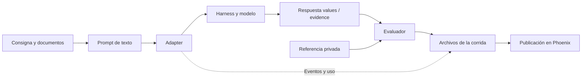

# Guía del proyecto: de un documento a un resultado

Este proyecto compara cómo distintos harnesses resuelven **la misma tarea documental**, y comprueba su respuesta con referencias verificadas. Para orientarte, seguí una tarea de principio a fin; después podés cambiar una pieza y ver qué efecto tuvo. Los comandos cotidianos están en [Operación](OPERACION.md).

[Inicio](../README.md) · [Índice de documentación](README.md)

## Las palabras que usamos

| Término | Qué significa acá |
|---|---|
| Dataset | Documentos, consignas, tipos de campos y respuestas esperadas que forman una evaluación. |
| Caso o expediente | Grupo de documentos relacionados, identificado por `case_id`. Puede tener varias tareas y documentos de distintos años. |
| Tarea | Una consigna con documentos y campos concretos, identificada por `task_id`. Cada repetición provoca una invocación al harness. |
| Harness | Programa que dirige al modelo, administra su interacción y le ofrece herramientas. Hoy: Pi, Tau y Codex; luego el corporativo. |
| Modelo | El modelo que usa ese harness: por ejemplo, Sol. `thinking=medium` configura el razonamiento. Cambiarlo también cambia el experimento. |
| Adapter | Nuestro conector: inicia el harness y traduce su protocolo a una respuesta y telemetría comunes. |
| Runner | Nuestro coordinador: carga tareas, invoca el adapter, evalúa cada respuesta y guarda resultados. |
| Ground truth | Respuesta esperada y procedencia de sus datos. Es material privado del evaluador. |
| Evaluador o scorer | Código determinista que comprueba formato, valores y referencias documentales. No le pide a otro modelo que juzgue. |
| Run o corrida | Ejecución guardada para una combinación de harness/modelo/configuración, tareas seleccionadas y repeticiones. Tiene `run_id` propio. |
| Phoenix | Interfaz donde consultamos datasets, experimentos, scores y trazas. Los archivos locales permiten conservar y volver a publicar resultados. |

Separar **harness** y **modelo** permite mantener Sol en medium y cambiar solamente Pi por Codex. Si también cambiamos el modelo, la diferencia observada corresponde a esa combinación completa.

## El recorrido real



El **runner** coordina ese recorrido. El prompt contiene rutas a los documentos, no sus respuestas esperadas. Con los perfiles nativos de Docker, el worker recibe únicamente los documentos asignados, montados en lectura; `ground_truth/`, código del evaluador y reportes quedan afuera.

Hay dos puertas de entrada al mismo runner: [`run.py`](../run.py) agrega publicación de reportes en Phoenix; [`python3 -m evals`](../evals/__main__.py) guarda los reportes localmente. Un perfil con OTel nativo puede enviar sus propias trazas incluso en el segundo modo; [Operación](OPERACION.md) explica la diferencia.

**Ambas puertas eligen el minimal por defecto.** `--harness all` selecciona los tres harnesses, no el dataset completo. `--dataset` elige el conjunto y `--task` limita la tarea; si omitís `--task`, se ejecutan todas las tareas del conjunto seleccionado.

## Dónde vive cada cosa

| Lugar | Para qué abrirlo |
|---|---|
| [`datasets/tax-document-dataset-v0.1/`](../datasets/tax-document-dataset-v0.1/) | Kit de fuentes originales, checksums y licencias. No es directamente ejecutable. |
| [`scripts/prepare_full_dataset.py`](../scripts/prepare_full_dataset.py) | Construcción reproducible del dataset completo: selección de campos, consignas, referencias y conciliaciones. No llama modelos. |
| [`datasets/tax-document-eval-v1/`](../datasets/tax-document-eval-v1/) | Dataset preparado: `inputs/`, `tasks.json`, `manifest.json` y `ground_truth/`. Tiene 366 tareas. |
| [`datasets/tax-mini-poc/`](../datasets/tax-mini-poc/) | Dataset pequeño original de seis tareas; también conserva el scorer compartido `grade.py`. |
| [`evals/datasets/loader.py`](../evals/datasets/loader.py) y [`contracts.py`](../evals/contracts.py) | Validación del dataset y estructuras internas: separan la entrada del harness de la respuesta esperada. |
| [`evals/experiments/`](../evals/experiments/) | Prompt, ejecución, comparación y fingerprints que identifican versiones compatibles. |
| [`harnesses/`](../harnesses/), [`evals/adapters/`](../evals/adapters/) y [`containers/`](../containers/) | Perfiles, protocolos de cada CLI y entorno donde se ejecutan. |
| [`evals/evaluators/`](../evals/evaluators/) y [`evals/reporting/`](../evals/reporting/) | Evaluación de respuestas, exportación de scores, trazas e importación en Phoenix. |
| `runs/` y [`artifacts/`](../artifacts/) | `runs/` contiene salidas locales de trabajo; `artifacts/` conserva los respaldos y evidencia versionados que decidimos guardar. |
| [`tests/`](../tests/) y [`docs/`](./) | Pruebas del comportamiento y documentación de uso, decisiones y auditorías. |

El [informe del dataset completo](FULL_DATASET_AUDIT.md) detalla qué campos verificamos y qué fuentes quedaron fuera. Evaluamos extracción y conciliaciones explícitas; no certificamos una declaración fiscal completa.

## Una tarea real, de punta a punta

Vamos a seguir **`extract_taxcalc_ty25_ca_001_w2_1`**: extraer seis importes de [este W-2](../datasets/tax-document-eval-v1/inputs/taxcalc/ty25-ca-001/w2_1.pdf), dentro del expediente `ty25-ca-001`.

### 1. La tarea dice qué pedir

En [`tasks.json`](../datasets/tax-document-eval-v1/tasks.json), buscamos ese `task_id`. Este es un **fragmento reducido**: omite la consigna y cuatro campos, así que no reemplaza la tarea completa.

```json
{
  "task_id": "extract_taxcalc_ty25_ca_001_w2_1",
  "case_id": "ty25-ca-001",
  "tax_year": 2025,
  "documents": ["inputs/taxcalc/ty25-ca-001/w2_1.pdf"],
  "fields": {
    "wages": "money",
    "federal_income_tax_withheld": "money"
  }
}
```

La consigna completa asigna casillas `1` a `6`, exige leer los importes impresos y distingue cero de casilla vacía. El año 2025 viene del contexto explícito del expediente. `source_group_id` identifica casos que comparten documentos; `split=development` señala que este conjunto se usa para desarrollo.

### 2. El manifest identifica el archivo

[`manifest.json`](../datasets/tax-document-eval-v1/manifest.json) enlaza la ruta con un identificador estable, hash y cantidad de páginas. Fragmento de la entrada real; se omiten metadatos de procedencia:

```json
{
  "document_id": "taxcalc_ty25_ca_001_w2_1",
  "path": "inputs/taxcalc/ty25-ca-001/w2_1.pdf",
  "sha256": "a54285616068d0d7c094e9f11d348f963ba3ebf56d4d5f5eea4e842dfd021879",
  "page_count": 1
}
```

`task_id` identifica **el trabajo**; `document_id` identifica **la evidencia**. El loader verifica el hash antes de ejecutar y comprueba que cada referencia esperada corresponda a un documento y página asignados.

### 3. La referencia queda del lado del evaluador

En [`ground_truth/expected.json`](../datasets/tax-document-eval-v1/ground_truth/expected.json), la entrada está bajo `answers[task_id]`. Este fragmento muestra únicamente `wages`; **no es una respuesta completa válida para la tarea**:

```json
{
  "values": {"wages": "2248.00"},
  "evidence": {
    "wages": [{"document_id": "taxcalc_ty25_ca_001_w2_1", "page": 1, "box": "1"}]
  }
}
```

[`field_types.json`](../datasets/tax-document-eval-v1/ground_truth/field_types.json) repite los tipos para el evaluador; el loader exige que coincidan exactamente con la tarea. [`provenance.json`](../datasets/tax-document-eval-v1/ground_truth/provenance.json) explica de qué fuente salió cada valor y cómo se verificó. Ese material no se agrega al prompt.

### 4. El renderer arma el texto de entrada

[`build_prompt()`](../evals/experiments/prompt.py) combina contexto, rutas, consigna, campos y contrato de respuesta. En Docker, el comienzo real es:

```text
Dataset: tax-document-eval-v1
Dataset inputs: /workspace/inputs
Task ID: extract_taxcalc_ty25_ca_001_w2_1
Case: ty25-ca-001
Tax year: 2025

Documents for this task:
- taxcalc_ty25_ca_001_w2_1: /workspace/inputs/taxcalc/ty25-ca-001/w2_1.pdf
```

Después incluye la consigna completa, los seis campos y reglas comunes: importes como strings con dos decimales, referencias `document_id/page/box` y un único objeto JSON `values/evidence`. El perfil elige cómo lanzar la CLI; el adapter entrega el texto por stdin y recoge su respuesta final.

Para ver el prompt completo desde la raíz del repositorio, sin ejecutar el harness ni mostrarle referencias privadas:

```bash
python3 - <<'PY'
from pathlib import Path
from evals.datasets.loader import load_examples
from evals.experiments.prompt import build_prompt
dataset = Path("datasets/tax-document-eval-v1")
examples, _ = load_examples(dataset)
task = next(e.input for e in examples if e.input.task_id == "extract_taxcalc_ty25_ca_001_w2_1")
print(build_prompt(task, dataset, document_root=Path("/workspace")))
PY
```

### 5. El harness devuelve la respuesta

Esta sí es una **respuesta completa válida y correcta** para esta tarea, con los seis campos y sus referencias. No lleva envoltorio `answers`, `task_id` ni Markdown en stdout:

```json
{
  "values": {
    "wages": "2248.00",
    "federal_income_tax_withheld": "11.00",
    "social_security_wages": "2248.00",
    "social_security_tax_withheld": "139.00",
    "medicare_wages_and_tips": "2248.00",
    "medicare_tax_withheld": "33.00"
  },
  "evidence": {
    "wages": [{"document_id": "taxcalc_ty25_ca_001_w2_1", "page": 1, "box": "1"}],
    "federal_income_tax_withheld": [{"document_id": "taxcalc_ty25_ca_001_w2_1", "page": 1, "box": "2"}],
    "social_security_wages": [{"document_id": "taxcalc_ty25_ca_001_w2_1", "page": 1, "box": "3"}],
    "social_security_tax_withheld": [{"document_id": "taxcalc_ty25_ca_001_w2_1", "page": 1, "box": "4"}],
    "medicare_wages_and_tips": [{"document_id": "taxcalc_ty25_ca_001_w2_1", "page": 1, "box": "5"}],
    "medicare_tax_withheld": [{"document_id": "taxcalc_ty25_ca_001_w2_1", "page": 1, "box": "6"}]
  }
}
```

Los adapters de Pi/Tau/Codex extraen ese objeto de los eventos de su CLI. El perfil corporativo de ejemplo admite directamente JSON. El adapter no corrige un monto ni completa un campo faltante para que apruebe.

### 6. Se califica y se guarda

El evaluador comprueba formato, valor y conjunto exacto de referencias por campo. En este W-2, `2248.00` aparece en las casillas **1, 3 y 5**: citar la `3` para `wages` conserva el monto correcto, pero falla la evidencia. Para aprobar la tarea deben pasar todos los campos, el formato y la ejecución.

El nombre `tax-mini-v2` es histórico: [`evals/evaluators/tax_mini.py`](../evals/evaluators/tax_mini.py) reutiliza la función genérica de [`datasets/tax-mini-poc/grade.py`](../datasets/tax-mini-poc/grade.py), también con las referencias del dataset completo. La CLI independiente de `grade.py` sigue ligada al minimal; usá los entrypoints del proyecto para evaluar el completo.

El runner crea `runs/<run_id>/`. Para entender qué ocurrió, seguí este orden:

| Archivo | Qué mirar |
|---|---|
| `scores.csv` | Una fila por tarea/repetición: aprobación, exactitud, estado y tiempo. |
| `report.json` | Buscar `rows[]` por `task_id` y `repetition`: `input` es el prompt exacto, `output` la respuesta, y `scores.fields` dice qué valor o evidencia falló. |
| `dataset-snapshot.json` | Buscar `examples[]` por `task_id` para comparar con `expected`. Contiene todo el dataset, aunque la corrida haya seleccionado una sola tarea. Es privado del evaluador. |
| `tasks/<task_id>-<repetition>/events.json` y `traces.json` | Eventos normalizados y spans para reconstruir la ejecución; `trace_id` conecta el reporte con Phoenix. |

`complete=true` y exit code `0` indican finalización, no aprobación. Leé `summary.tasks_passed` frente a `summary.tasks_evaluated` y `rows[].scores.task_pass`. Los errores de ejecución también cuentan en los resultados. Las [corridas reales conservadas](../artifacts/2026-09-13/full-dataset/README.md) permiten inspeccionar ejemplos sin volver a llamar modelos.

## Qué tocar cuando quieras cambiar algo

| Quiero cambiar… | Punto de entrada y comprobación |
|---|---|
| Una consigna del dataset completo | [`prepare_full_dataset.py`](../scripts/prepare_full_dataset.py): instrucciones de extracción o conciliación. Generar en una carpeta nueva y revisar el diff de `tasks.json`. |
| Las reglas comunes del prompt | [`evals/experiments/prompt.py`](../evals/experiments/prompt.py). Revisar `PROMPT_VERSION` y los tests de prompt; afecta a todas las tareas. |
| Campos, valores esperados o casillas | La definición correspondiente: [`taxcalc_boxes.py`](../scripts/taxcalc_boxes.py), [`prior_1040_labels.py`](../scripts/prior_1040_labels.py), [`fake_w2_labels.py`](../scripts/fake_w2_labels.py) o `structured_fields()` del builder. Verificar la fuente y regenerar tarea, tipos, referencia y procedencia juntos. |
| Qué significa aprobar | [`schema.py`](../evals/evaluators/schema.py), [`tax_mini.py`](../evals/evaluators/tax_mini.py) y el scorer compartido. Agregar una respuesta incorrecta que antes pasaba o una correcta que antes fallaba; revisar `EVALUATOR_VERSION`. |
| Harness, modelo o razonamiento | Un perfil en [`harnesses/`](../harnesses/), o flags `--harness`, `--model`, `--thinking`. Para el corporativo, partir de [`corporate.example.json`](../harnesses/corporate.example.json) y seguir [la guía corporativa](CORPORATE_READINESS.md). |
| Protocolo de respuesta o entorno | [`native.py`](../evals/adapters/native.py), [`runtime.py`](../evals/adapters/runtime.py) y la imagen. Mantener el contrato `values/evidence` y probar el límite entre proceso y evaluador. |
| Visualización, exportación o trazas | [`evals/reporting/`](../evals/reporting/). Cambiar cómo se publica no debería alterar la respuesta guardada ni su score. |

Para trabajar cómodo, elegí primero una tarea representativa y conservá su corrida inicial. Hacé el cambio en la definición correspondiente, revisá las pruebas relacionadas y ejecutá esa tarea antes de ampliar la matriz. Para una nueva clase de documento, verificá también una respuesta deliberadamente incorrecta: acertar la referencia no demuestra que el evaluador detecte errores.

Los originales del kit y los respaldos históricos se conservan como evidencia. `tax-document-eval-v1` es una salida reproducible: editar a mano solamente su `expected.json` rompe esa relación. El kit original y el dataset preparado verifican también la lista exacta de archivos; la documentación nueva va en `docs/`. El builder ofrece `--output RUTA_NUEVA` y `--check`; los pasos están en [Preparación y ejecución](FULL_DATASET_READINESS.md).

Los fingerprints cambian cuando cambia el dataset, contrato o scoring; incluso los comentarios en archivos de contrato/scoring afectan su hash. Antes de comparar un resultado nuevo con uno antiguo, consultá [FINGERPRINTS.md](FINGERPRINTS.md): una mejora de consigna o una corrección de referencia también cambia qué estamos midiendo.
